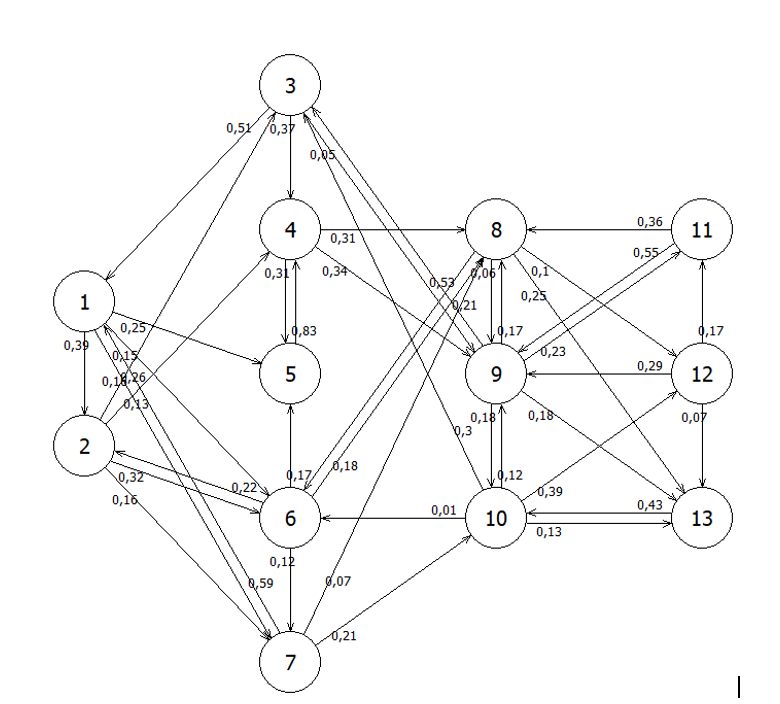
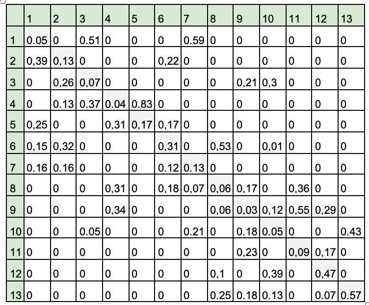

# Контрольная работа про математическому и имитационному моделированию
#### 4 семестр, 2021 | [Отчет](%D0%9E%D1%82%D1%87%D0%B5%D1%82.docx)

Задание 1
------------
[Решение (код)](part_1.py)  
  
Система имеем 13 дискретных состояний. Изменение состояний происходит в дискретные моменты времени с заданной вероятность. Схема марковского процесса изображена на рисунке.

<!--  -->

<!--  -->

Требуется определить:
1. вероятность того, что за 10 шагов система перейдет из состояния 8 в состояние 10;
2. вероятности состояний системы спустя 6 шагов, если в начальный момент вероятность состояний были следующими A=(0,03;0,05;0;0,03;0,16;0,17;0,05;0,01;0,06;0,14;0,13;0,02;0,15);
3. вероятность первого перехода за 10 шагов из состояния 13 в состояние 5;
4. вероятность перехода из состояния 5 в состояние 3 не позднее чем за 5 шагов;
5. среднее количество шагов для перехода из состояния 13 в состояние 11;
6. вероятность первого возвращения в состояние 6 за 5 шагов;
7. вероятность возвращения в состояние 6 не позднее чем за 7 шагов;
8. среднее время возвращения в состояние 1;
9. установившиеся вероятности.  

Задание 2
------------
[Решение (код)](part_2.py) 
  
Задана система массового обслуживания со следующими характеристиками:
  * интенсивность поступления	λ=36
  * каналов обслуживания m=7
  * интенсивность обслуживания μ=7
  * максимальный размер очереди n=6 
     
  Изначально требований в системе нет.

1. Составьте граф марковского процесса, запишите систему уравнений Колмогорова и найдите установившиеся вероятности состояний.
2. Найдите вероятность отказа в обслуживании.
3. Найдите относительную и абсолютную интенсивность обслуживания.
4. Найдите среднюю длину в очереди.
5. Найдите среднее время в очереди.
6. Найдите среднее число занятых каналов.
7. Найдите вероятность того, что поступающая заявка не будет ждать в очереди.
8. Найти среднее время простоя системы массового обслуживания.
